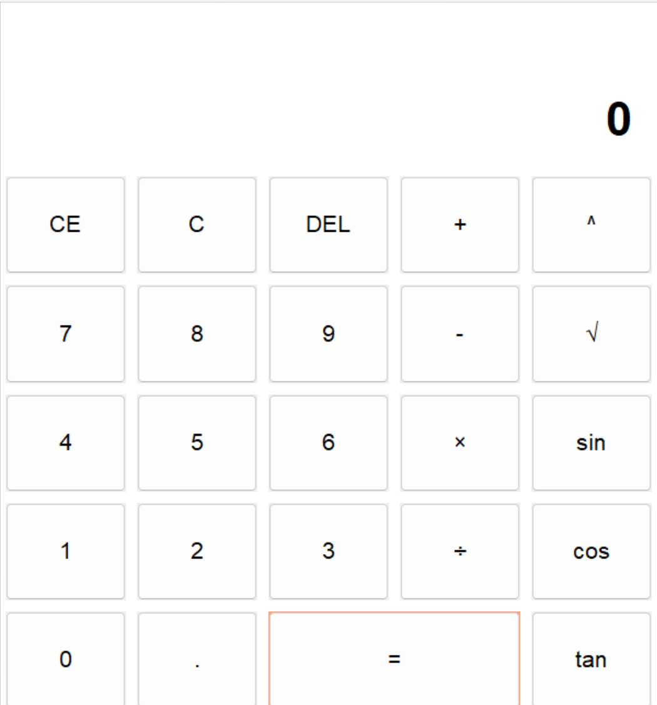

# 科学计算器与俄罗斯方块游戏

这是一个结合科学计算器和俄罗斯方块游戏的Python应用程序。

## 主要功能

### 科学计算器功能
- 基本运算：加(+)、减(-)、乘(×)、除(÷)
- 科学计算：幂运算(^)、平方根(√)
- 三角函数：sin、cos、tan
- 对数运算：log
- 阶乘计算：n!
- 错误处理：友好的错误提示
- 自适应界面：自动调整字体大小

### 俄罗斯方块游戏功能
- 7种经典方块形状
- 方块旋转和移动控制
- 自动下落和加速下落
- 行消除和计分系统
- 游戏结束判断和重新开始

### 彩蛋功能
在计算器输入框中输入"tetris"（不区分大小写），然后按等号键(=)，将会启动俄罗斯方块游戏！

## 快速开始

1. 确保安装Python 3.6+和必要的库：
   ```bash
   pip install pygame
   ```

2. 运行计算器：
   ```bash
   python main.py
   ```

3. 使用方式：
   - 使用鼠标点击按钮或直接键盘输入
   - 输入"tetris"并按=键启动俄罗斯方块游戏
   - 游戏控制：
     - ←→↓ 移动方块
     - ↑ 旋转方块
     - 空格 快速下落
     - R 重新开始游戏

## 截图




## 文件结构
```
.
├── main.py            # 计算器主程序
├── function.py        # 计算器功能实现
├── other/
│   ├── Tetris.py      # 俄罗斯方块游戏实现
│   └── image.png      # 计算器截图
└── README.md          # 说明文档
```

## 注意事项
- 确保所有文件保持在相同目录下
- 俄罗斯方块游戏需要pygame库支持
- 计算器可以独立运行，不需要pygame
