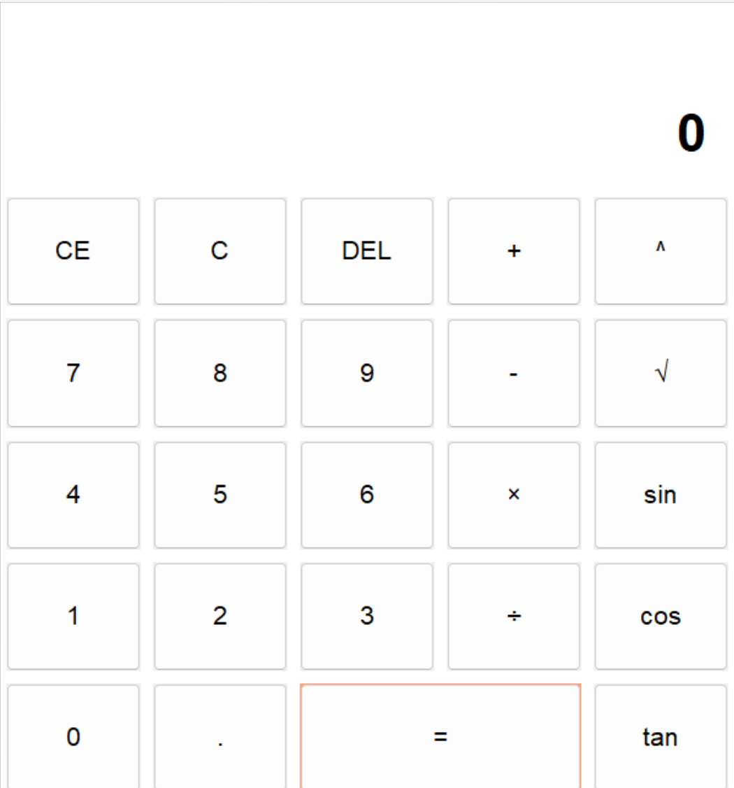

# 科学计算器

## 简介

一个简单的Python科学计算器，支持基本的算术运算以及平方根、幂、正弦、余弦和正切等科学运算。

## 功能

- 基本算术运算（加法、减法、乘法、除法、幂运算）
- 科学运算（平方根、正弦、余弦、正切）
- 界面自适应字体大小
- 错误提示（无效的表达式、除以零等）

## 使用方法

1. 确保您的系统已安装Python。
2. 下载或克隆该项目到本地。
3. 运行`main.py`文件。
4. 在界面上输入算术表达式或使用按钮进行计算。
5. 查看结果并根据需要进行进一步操作。

## 项目结构

- **main.py**: 主程序文件，创建计算器界面并绑定按钮功能。
- **function.py**: 包含计算器所需的各种功能函数，如创建窗口、文本输入框、结果显示标签等。
- **README.md**: 项目说明文档。

## 作者

ZZW

## 截图

